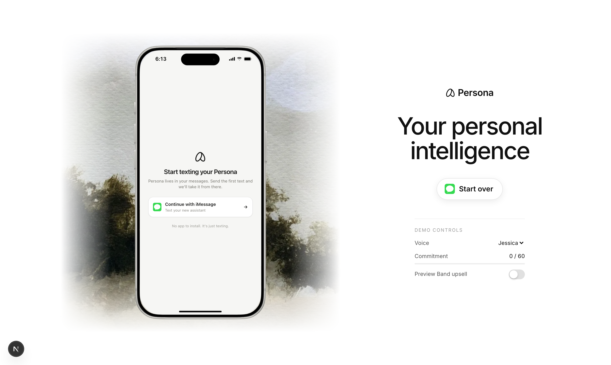
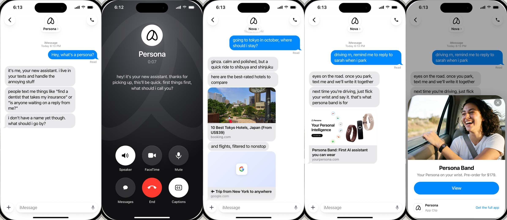

# Persona onboarding

A conversational onboarding for [Persona](https://yourpersona.com), the AI assistant that lives in your messages, built as an iOS 26 web simulator with a real voice call.

**Try it:** https://persona-onboarding-riyad.vercel.app





## What it does

The onboarding collects four things without feeling like a form:

| | How |
|---|---|
| **The assistant's name** | Over text, right away ("i don't have a name yet though. what should i go by?"). The call voice then matches the name: male, female or neutral. |
| **Your name** | On a quick phone call, or by text if you'd rather not talk |
| **What you need help with** | On the call (it digs one level deeper than "stuff"), or by text |
| **A connected Gmail** | A one-tap Google card, sent *during* the call once you say yes |

The phone call is offered right after naming and collects everything except the assistant's name. Anything the call doesn't get is picked up over text.

### Built for people who don't play by the rules
- **Hang-ups, dropped calls, page reloads mid-call, declined or missed calls, blocked microphones:** each becomes an event the text side follows up on naturally. It picks up where the call left off, and anything promised on the call ("i'll text you a few options") actually gets delivered.
- **Refusals are respected:** say no to the call or to Google and it never pushes again.
- **Off-script input is handled:** message bursts, typos, other languages, prompt injection, "you pick a name", renaming it mid-chat, asking what model it is.
- **Graduate early:** lead with a real request ("find me a hotel in tokyo") and it helps immediately, weaving in the setup afterward. Say "skip the setup" and you're through.
- **Gentle steering:** a deterministic onboarding plan picks the single next thing to ask, gives each item at most two tries, and waits until you've been helped before asking again.

### It actually does things
- **Live web research** with sources: picks, prices, places, comparisons.
- **Read-only Gmail and Calendar** once connected: "did sarah reply?", "when am i free next week?". It asks before reading your inbox.
- **Honest about limits:** it researches and drafts, but says plainly that it can't book or pay yet, and never invents facts, links or email contents.

## The Persona Band upsell

Persona's business is an AI agent that sells the [Persona Band](https://yourpersona.com/band). The upsell is **earned**, not scheduled:

1. **Commitment score** (`src/lib/engagement.ts`): deterministic points for real usage, such as naming it, finishing a call, connecting Gmail, and above all asking it to do real tasks. The threshold is 60.
2. **Band moment:** on every reply, the agent flags whether your message describes a situation the Band is made for: driving, the gym, cooking, back-to-back meetings, walking the dog, just landing with bags, taking notes.
3. **The app decides.** The pitch only happens when **score ≥ threshold and it's a Band moment**, once. The model can't pitch on its own. It answers your request first, then adds one line tied to your exact situation:
   > *driving rn, remind me to reply to sarah when i park*
   > → "next time you're driving, you can just flick your wrist and talk to me, no phone needed. that's what persona band is for."
4. **Rendered with real iOS building blocks:** an iMessage rich link (Persona's own share card), then an **App Clip card**, then an App Clip product page. [`appclip-poc/`](appclip-poc) is a real Xcode App Clip that presents the native Apple Pay sheet as a **deferred-payment pre-order** ($179 now, charged when it ships), showing the flow is buildable natively.

In testing, it pitched in 7 of 7 Band moments, stayed quiet in 3 of 3 non-moments, and held back for a low-commitment user.

## How it's built

| Piece | Where | Notes |
|---|---|---|
| Text agent | `src/lib/agent.ts`, `/api/chat` | Claude Opus 5.5 with structured output (bubbles, collected fields, actions). Only the bubbles reach the user. Tool loop: web search + Gmail/Calendar. Prompt-cached. |
| Onboarding plan | `src/lib/onboarding.ts` | What's missing, the next step (round-robin, max 2 attempts, declines respected), and when graduation is allowed. |
| Voice call | `src/components/Call.tsx` | ElevenLabs Agents over WebRTC in the browser, Eleven v4 Turbo voice, Claude Sonnet 5. A per-call prompt is built from the conversation; in-call tools send the Google link, save your name and need, and check status. Agents require a server-issued token. |
| Shared state | `src/components/Onboarding.tsx` | One state object drives both the text and voice sides. Call outcomes become events for the text agent. |
| Google | `/api/google/*` | OAuth (read-only scopes), tokens in an encrypted http-only cookie. If Google blocks an unapproved tester, a clearly labeled demo sign-in keeps the flow completable. |
| iOS 26 UI | `src/components/ios.tsx`, `Thread.tsx`, `cards.tsx` | Liquid Glass nav and input, bubble tails, Delivered/Read, typing indicator, Dynamic Island live-call pill, iMessage link previews (`/api/unfurl` with generated fallback cards). |
| Band | `src/components/band.tsx`, `src/lib/engagement.ts` | Rich link → App Clip card → App Clip. |

Also included: an optional **iMessage channel** (`src/lib/imessage.ts`: Sendblue or BlueBubbles transport, real Twilio calls). It's not part of the web deliverable.

## Testing

Simulations play AI users against the real agent, and a judge model grades each transcript for naturalness, form-feel, edge-case handling, progress, and hard violations (asking for email, false claims, leaked internals…). Every run prints its real cost and stops at `SIM_BUDGET`.

| Suite | Personas | Command |
|---|---|---|
| Text onboarding | 16 (hates calls, hangs up early, skeptic, injection, early graduate, confused, Spanish, …) | `npm run sim:text` |
| Voice calls | 12 (interrupter, rambler, near-silent, wrong number, "can't find the link", refuser, …) | `npm run sim:voice` |
| Band upsell | 11 (moments, non-moments, low-commitment gate) | `npm run sim:band` |

Iterating against these got the text suite to 13 of 16 conversations with no violations, and took voice from 29 violations to 3 across 12 calls. It also caught real bugs, including the voice model occasionally speaking tool-call markup and a filter that silently dropped email drafts.

## Running locally

```bash
npm install
cp .env.example .env.local     # add your keys
npm run setup:agents           # create/update the ElevenLabs voice agents (prints the agent id)
npm run dev
```

Needs Anthropic, ElevenLabs and Upstash Redis keys; Google OAuth is optional (a labeled demo sign-in is used without it). See [`.env.example`](.env.example).

## Notes

- Google sign-in is unverified, so only accounts added as test users can connect a real Gmail. Everyone else gets the demo sign-in.
- Conversations are stored for 30 days for review (see `/privacy`).
- Persona's name, logo, product imagery and iPhone frame belong to Persona and are used here only for this onboarding exercise.
